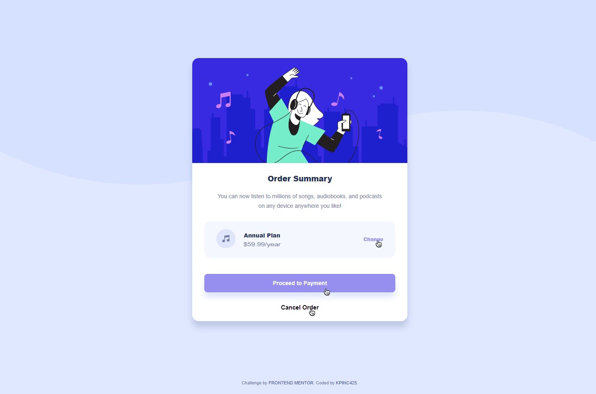

# Frontend Mentor - Order summary card solution

This is a solution to the [Order summary card challenge on Frontend Mentor](https://www.frontendmentor.io/challenges/order-summary-component-QlPmajDUj). Frontend Mentor challenges help you improve your coding skills by building realistic projects. 

## Table of contents

- [Overview](#overview)
  - [The challenge](#the-challenge)
  - [Screenshot](#screenshot)
  - [Links](#links)
- [My process](#my-process)
  - [Built with](#built-with)
  - [What I learned](#what-i-learned)
  - [Continued development](#continued-development)
  - [Useful resources](#useful-resources)
- [Author](#author)
- [Acknowledgments](#acknowledgments)

## Overview

Used Sass and some basic html to create an order summary card built mobile first, but responsive at many sizes.

### The challenge

Users should be able to:

- See hover states for interactive elements

### Screenshot




### Links

- Solution URL: [Add solution URL here](https://your-solution-url.com)
- Live Site URL: [Add live site URL here](https://your-live-site-url.com)

## My process

I have been wanted to break down some of the technologies I have worked with into smaller parts to better understand them. For such simple task, I thought setting some basic Sass and practicing the .sass indent formatting would be interesting as I had some fun learning it in a previous project. I used the basic skeloton provided and worked from top down doing my best to replicate the design images.

### Built with

- HTML
- CSS custom properties
- Dart-Sass
- Flexbox
- Mobile-first workflow

### What I learned

I mostly too a small dive into the history of Sass and its evolution to the most widely used Dart-Sass. Used the most basic version with npm script to watch the files for changes. 

I learned a bit more about hsl color system and mixing systems, by making a sass variable and using it in a rgba color we can change the opacity on the fly.

```
    box-shadow: 0px 15px 15px rgba($DesaturatedBlue, 0.3)
```

This alloud me to use the same color for a shadow but lighten it up a bit quickly.

### Continued development

I think future challenges will be either react or web components to start building a libray of reusable components for future projects

### Useful resources

- [Sass Doc's](https://sass-lang.com/guide) - I looked a couple of different places first, but nothing usually beats the documentation, sprinkled with some patience.
- [Steve Griffins Intro Video](https://www.youtube.com/watch?v=5jZGo_k8Rd0) - Sometimes you just need a visual aid, I was just having trouble connecting some dots.

## Author

- Website - [Coming Soon](https://www.your-site.com)
- Frontend Mentor - [@KPInc425](https://www.frontendmentor.io/profile/KPInc425)


## Acknowledgments

Google is pretty good!
